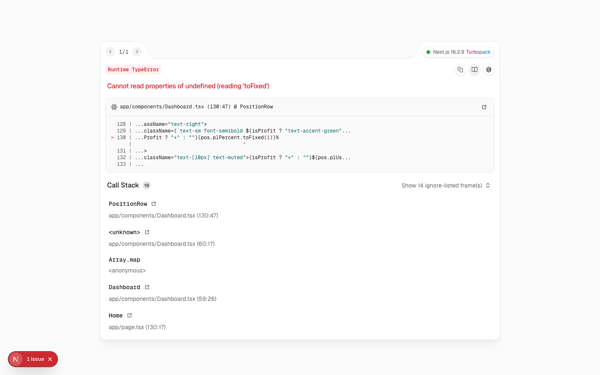

# Event Intelligence OS

시장 이벤트를 구조화하고, 가설·포지션·검증 결과를 한 흐름으로 관리하는 리서치 워크스페이스입니다. 이벤트 간 인과 관계와 확률 변화를 추적해, 의사결정의 근거를 다시 확인할 수 있도록 설계했습니다.



## What it does

- **Event radar** — SEC EDGAR, Polymarket, 가격 데이터를 수집하고 중요한 변화를 우선순위로 정리합니다.
- **Causal graph** — 이벤트, 이해관계자, 자산 사이의 연결을 그래프로 탐색합니다.
- **Thesis workflow** — 투자 가설의 근거·반증 조건·신뢰도를 기록하고 상태 변화를 추적합니다.
- **Portfolio workspace** — 포지션, 경보, 리밸런싱 제안과 사후 분석을 한 화면에서 다룹니다.
- **Point-in-time backtesting** — 당시 시점에 이용 가능했던 정보만 사용하도록 스냅샷 기반 검증을 지원합니다.

## Architecture

```text
event-intelligence-os/
├── apps/
│   ├── api/          FastAPI application, domain services, Alembic migrations
│   ├── worker/       Celery jobs for ingestion and monitoring
│   └── web/          Next.js dashboard
├── infra/            PostgreSQL, Redis, MinIO via Docker Compose
└── .env.example      Local configuration template
```

| Layer | Stack |
| --- | --- |
| Web | Next.js 16, React 19, TypeScript, Tailwind CSS, React Query, Recharts |
| API | FastAPI, SQLAlchemy, Alembic, Pydantic |
| Jobs | Celery, Redis |
| Data | PostgreSQL, MinIO |

## Run locally

### Prerequisites

- Node.js 22+
- Python 3.12+
- Docker Desktop (recommended)

### 1. Start infrastructure

```bash
cd infra
docker compose up -d
```

### 2. Configure and prepare the API

```bash
cd apps/api
python3 -m venv .venv
source .venv/bin/activate
pip install -r requirements.txt

cp ../../.env.example .env
# Set OPENAI_API_KEY only when using event extraction.

alembic upgrade head
python scripts/seed.py
python scripts/seed_events.py
```

### 3. Run the services

```bash
# Terminal 1 — API
cd apps/api
uvicorn api.main:app --reload --port 8000

# Terminal 2 — background worker
cd apps/api
celery -A worker.main worker -l info

# Terminal 3 — web app
npm install
npm run dev
```

Open [http://localhost:3000](http://localhost:3000).

## Selected endpoints

| Endpoint | Purpose |
| --- | --- |
| `GET /health` | Service health check |
| `POST /events/ingest/{source_name}` | Run an event ingestion source |
| `POST /prices/ingest/{symbol}` | Collect price data for a symbol |
| `GET /radar/opportunities` | Retrieve the event radar dataset |
| `POST /extract` | Extract structured events from source material |

## Operating boundaries

This project is a research and decision-support tool. It defaults to paper mode and does not place live orders. Automated ordering remains disabled through `ENABLE_LIVE_TRADING=false` and `ALLOW_AUTONOMOUS_ORDERS=false`.
